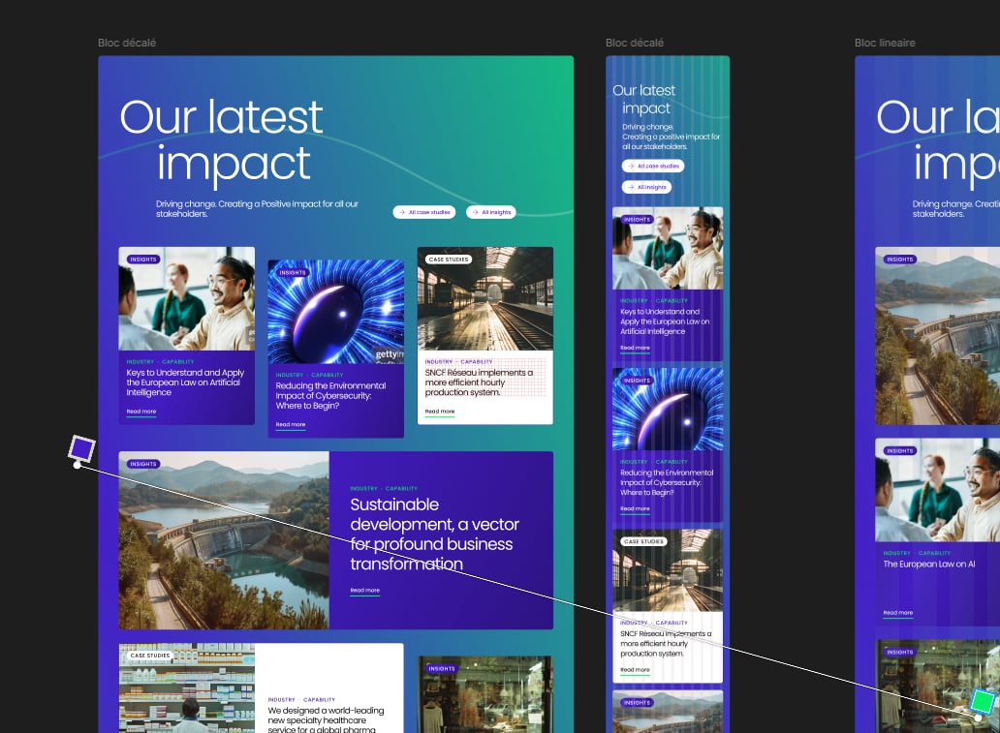

# TEST TECHNIQUE OCTAVE

### 📋 Temps par Tâche

| Tâche | Estimé | Réel |
|-------|--------|------|
| 1. Setup projet | 30 min | **20min** |
| 2. Section Hero | 1h 00 | **1h30** | 
| 3. Bloc linéaire desktop | 2h 00 | **1h30** |
| 4. Bloc décalé desktop | 2h 30 | **1h30** | 
| 5. Responsive mobile | 1h 30 | **2h00** | 
| 6. Animation SVG | 1h 00 | **2h30** | 
| 7. Théorie ACF + Gutenberg | 30min | **2h00** | (Avec le travail en plus)
| 8. Bonus JS (this) | 30 min | **30min** |
| 9. Finitions + tests | 1h 00 | **___h30** |
| 10. README + compte-rendu | 1h 00 | **1h30** |

### 📊 **Bilan Global**
```
🎯 Temps total estimé    : 11h 00
⏰ Temps total réel      : ___ h ___
📈 Écart total           : ___
📊 Taux de respect       : ___%
```

### 💬 **Analyse Détaillée des Écarts**

**1. Setup projet** ( +10 min d'avance) :  

**2. Section Hero** ( -30 min de retard) :  
_J'ai perdu du temps à cause du gradient de fond qui était très différent en copié collé depuis figma car les points de repères sont très loin sur la page et j'ai essayé de refaire au mieux possible à la main._
_Aussi le SVG passant derrière était trop petit pour les écran 1920+ n'ayant pas de contact avec le/la graphiste j'ai allongé un peu sur la gauche mais pas suffisant pour les écrans ultrawide(3440px), j'ai pas voulu perdre trop de temps dessus_



_Les repères du gradiant sont trop en dehors de la page pour réussir à appliquer le même avec un copié collé_

**3. Bloc linéaire desktop** ( +30 min d'avance) :  

**4. Bloc décalé desktop** ( +1h d'avance) :  
_Malgré le temps estimé, je pensais que ça allait être bcp plus rapide car j'avvais déjà préparé toutes les class tailwind car ce sont les même que pour le linaire. J'ai perdu beaucoup de temps à cause du décalage, j'avais des problèmes avec les tailles des cards qui prenaient en compte le translate des cards décalées. J'ai pris trop de temps à essayer de le régler uniquement en CSS avant de faire un script JS._

**5. Responsive mobile** (-30 min de retard) :  
_Un peu plus long que prévu car je n'avais pas pris en compte que les images étaient différentes en mobile et desktop. J'ai dû tricher un peu avec les ratios d'images car elles n'étaient pas dans un format standard._

**6. Animation SVG** (-1h30 de retard) :  
_J'avais fait le fade out/in au scroll en une 15ène de minutes mais j'ai voulu faire plus avec l'effet "corde qui brûle". Cependant, ça ne rend pas très bien et j'ai décidé d'arrêter de perdre du temps dessus._

**7. Théorie ACF + Gutenberg** (Je compte pas vraiment du retard sur ce point)
_Temps plus long car j'ai rédiger les fichier php et twig comme demandé_

**8. Bonus JS (this) (+-0)**

**9. Finitions + tests**

**10. README + compte-rendu (+30min)**

### 🎯 **Alternatives Explorées**

- Au début, mes layout des blocs étaient en grid, mais après l'avoir fait et en repensant à l'exercice d'intégration PHP plus tard, j'ai préféré tout passer en flexbox.

- Pour le format tablette au début j'aimais bien avoir la grande carde et la double card en full width, et les autres en 45% de largeur, mais en voyant le rendu sur le layout décalé avec une disposition différente ça ne rendais pas bien et j'ai donc gardé le format mobile jusqu'à l'affichage desktop.

- Pour l'animation SVG j'ai testé plusieurs choses, changement de couleurs progressif au scroll, disparition, ondulation, mais je suis finalement parti dans l'idée d'essayer la carde qui brûle malgrès que c'est kitch et en vrai ne match pas avec le design de la page pour montrer plus de travail.
Pour que au final, je me rappel de "La courbe doit se dessiner progressivement au fil du scroll" donc j'ai juste ineversé l'animation


### 📝 **Enseignements Clés**
- **Ce qui a bien fonctionné** : Structure modulaire avec Tailwind avec nottament les classes qui m'ont fais gagné énormément de temps
- **Principales difficultés** : Parfois j'ai voulu me prendre la tête avec des choses non nécéssaire (refaire le svg line, vouloir absolument ne pas passer par du JS)


### **Dynamisation sous WordPress**

1. Tout d'abord on va partir du principe que les articles existent déjà avec toute leurs infos (titre / sous titre / image desktop et mobile) et qu'ils ont en CPT les catégories Insight OU Case studies.

2. On va créer un ACF (le php complet est dans cr/acf.php)

3. Ensuite dans `function.php` on va ajouter 


```php
function register_our_latest_impact_block() {
    if (function_exists('acf_register_block_type')) {
        acf_register_block_type([
            'name' => 'our-latest-impact',
            'title' => __('Our Latest Impact'),
            'description' => __('Bloc dynamique Our Latest Impact'),
            'render_callback' => 'render_our_latest_impact_block',
            'category' => 'custom-blocks',
            'icon' => 'grid-view',
            'keywords' => ['impact', 'cards', 'hero'],
            'supports' => [
                'align' => false,
                'mode' => false,
                'jsx' => true
            ]
        ]);
    }
}
```

4. On a ensuite créé nos pages de rendu :
   - `single-classique.php` : Version PHP pure 
   - `block-our-latest-impact.php` : Version Timber + Twig avec template séparé

5. On ajoute l'enregistrement du bloc dans `function.php`

```php
add_action('acf/init', 'register_our_latest_impact_block');

function register_our_latest_impact_block() {
    if (function_exists('acf_register_block_type')) {
        acf_register_block_type([
            'name' => 'our-latest-impact',
            'title' => __('Our Latest Impact'),
            'render_callback' => 'render_our_latest_impact_block', // ← Votre fonction
            'category' => 'custom-blocks',
            'icon' => 'grid-view'
        ]);
    }
}
```
_Version PHP pure_
require_once get_template_directory() . '/assets/cr/single-classique.php';

_Version Timber + Twig_  
require_once get_template_directory() . '/assets/cr/block-our-latest-impact.php';


### **Avantages d’utiliser ACF Blocks**

ACF Blocks permet de créer des blocs personnalisés pour Gutenberg de façon simple et efficace, sans passer par du JS. La création se fait en PHP, ce qui facilite l’intégration.

Grâce à la puissance des champs ACF, il est possible d’ajouter facilement des champs dynamiques, conditionnels ou complexes (comme des répéteurs ou des relations). Cela permet une structuration plus poussée et personnalisable des contenus.

L’intégration est fluide côté back-office, avec une interface intuitive pour les utilisateurs, et une prévisualisation fidèle dans l’éditeur. Les blocs sont réutilisables, modulaires et maintenables, avec un contrôle total sur le rendu HTML via des templates PHP.

Du côté utilisateur final, ACF garantit une meilleure performance du site grâce à un HTML sémantique et optimisé, sans le code superflu des page builders, assurant des temps de chargement plus rapides et une excellente accessibilité et stabilité (pas de mises à jours qui cassent ton site etc ..).

En résumé, ACF Blocks offre une solution rapide, flexible et propre pour dynamiser Gutenberg tout en conservant un haut niveau de personnalisation et une excellente expérience utilisateur.

### **Autres solutions**

-**Timber + Twig**

Avantages : Séparation logique/présentation, templates plus lisibles, système de cache Twig
Inconvénients : Dépendance externe,

-**Gutenberg Blocks Natifs (React/VueJS)**

Avantages : Performance maximale
Inconvénients : Courbe d'apprentissage React, développement plus long, complexité pour les champs dynamiques

-**Page Builders (Elementor Pro/Divi/Oxygen Oxygen/...)**

Avantages : Interface drag & drop, widgets prêts à l'emploi
Inconvénients : Vendor lock-in, performance dégradée, code généré souvent lourd, payant avec abonnement


### **BonusJS**

`This` en JS représente un contexte d'exécution d'une fonction, sa valeur dépend de comment et où on appelle la dite fonction.
Il pointe dynamiquement vers un objet qu'il possède ou appelle une fonction au moment de son exécution.

-**Dans un objet**

```javascript
const personne = {
    nom: "Alexandre",
    saluer() {
        console.log(`Bonjour, je suis ${this.nom}`);
        // `this` fait référence à l'objet `personne`
    }
};

personne.saluer(); // "Bonjour, je suis Alexandre"
```

-**Fonction autonome**

```javascript
function direBonjour() {
    console.log(this);
}

direBonjour();
```

_Cela va nous renvoyer toutes les propriétés globales : document, location, navigator, etc._

-**Perte du contexte**

```javascript
const personne = {
    nom: "Alexandre",
    saluer() {
        console.log(`Bonjour, je suis ${this.nom}`);
    }
};

const salutation = personne.saluer;
salutation(); 
// "Bonjour, je suis undefined"
```

_`this` ne fait plus référence à `personne` !_

-**Dans une fonction fléchée c'est encore différent**

```javascript
const personne = {
    nom: "Alexandre",
    saluer() {
        // Fonction normale : `this` = personne
        setTimeout(function() {
            console.log(`Hello ${this.nom}`); // undefined (contexte perdu)
        }, 1000);
        
        // Arrow function : `this` hérité du contexte parent
        setTimeout(() => {
            console.log(`Hello ${this.nom}`); // "Hello Alexandre"
        }, 1000);
    }
};

personne.saluer();
```

_Les arrow functions "capturent" le `this` de leur contexte de définition et ne le changent jamais, tandis que les fonctions normales ont un `this` qui dépend de comment elles sont appelées._

-**Dans une classe**


```javascript
class Animal {
    constructor(nom) {
        this.nom = nom;  // `this` fait référence à l'instance créée
    }
    
    parler() {
        console.log(`${this.nom} fait du bruit`);
    }
}

const chien = new Animal("Francis");
chien.parler();

// "Francis fait du bruit"
```

_Donc chaque instance possède son propre `this`_

```javascript
const chien = new Animal("Francis");
const chat = new Animal("Minou");

chien.parler(); // "Francis fait du bruit" -> this = chien
chat.parler(); // "Minou fait du bruit" -> this = chat
```
